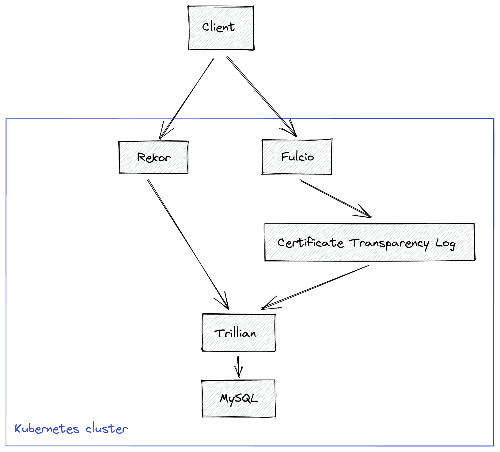

# sigstore-scaffolding

This repository contains scaffolding to make standing up a full sigstore stack
easier and automatable. Our focus is on running on Kubernetes and rely on
several primitives provided by k8s as well as some semantics. As a starting
point, below is a markdown version of a Google document that @nsmith5 and
@vaikas did based on a discussion in a sigstore community meeting on 2022-01-10.

# Sigstore automation for tests

<p style="text-align: right">
Ville Aikas &lt;vaikas@chainguard.dev></p>


<p style="text-align: right">
Nathan Smith &lt;sigstore@nfsmith.ca></p>


<p style="text-align: right">
2022-01-11</p>


# Background

Currently in various e2e tests we (the community) do not exercise all the components of the Sigstore when running tests. This results in us skipping some validation tests (for example, but not limited to, –insecure-skip-verify flag), or using public instances for some of the tests. Part of the reason is that there are currently some manual steps or some assumptions baked in some places that make this trickier than is strictly necessary. At Chainguard we use all the sigstore components heavily and utilize GitHub actions for our e2e/integration tests, and have put together some components that might make it easier for other folks as well as upstream to do more thorough testing as well as hopefully catch breaking changes by ensuring that we have the ability to test the full stack by various clients (for example, Tekton Chains is one example, I’m sure there are others).

A wonderful very detailed document for standing all the pieces from scratch is given in Luke Hinds’ “[Sigstore the hard way](https://github.com/lukehinds/sigstore-the-hard-way)”


# Overview

This document is meant to describe what pieces have been built and why. The goals are to be able to stand up a fully functional setup suitable for k8s clusters, including KinD, which is what we use in our GitHub actions for our integration testing.

Because we assume k8s is the environment that we run in, we make use of a couple of concepts provided by it that make automation easier.


* [Jobs](https://kubernetes.io/docs/concepts/workloads/controllers/job/) - Run to completion abstraction. Creates pods, if they fail, will recreate until it succeeds, or finally gives up.
* [ConfigMaps](https://kubernetes.io/docs/concepts/configuration/configmap/) - Hold arbitrary configuration information
* [Secrets](https://kubernetes.io/docs/concepts/configuration/secret/) - Hold secrety information, but care must be taken for these to actually be secret

By utilizing the Jobs “run to completion” properties, we can construct “gates” in our automation, which allows us to not proceed until a Job completes successfully (“full speed ahead”) or fails (fail the test setup and bail). These take a form of using kubectl wait command, for example, waiting for jobs in ‘mynamespace’ to complete within 5 minutes or fail.:


```
kubectl wait --timeout 5m -n mynamespace --for=condition=Complete jobs --all
```


Another k8s concept we utilize is the ability to mount both ConfigMaps and Secrets into Pods. Furthermore, if a ConfigMap or Secret (and more granularly a ‘key’ in either, but it’s not important) is not available, the Pod will block starting. This naturally gives us another “gate” which allows us to deploy components and rely on k8s to reconcile to a known good state (or fail if it can not be accomplished).


# Components

Here’s a high level overview of the components in play that we would like to be able to spin up with the lines depicting dependencies. Later on in the document we will cover each of these components in detail, starting from the “bottom up”.



## [Trillian](https://github.com/google/trillian)

For Trillian, there needs to be a database and a schema before Trillian services are able to function. Our assumption is that there is a provisioned mysql database, for our Github actions, we spin up a [container](https://hub.docker.com/_/mysql) that has the mysql running, and then we need to create a [schema](https://github.com/google/trillian/blob/master/storage/mysql/schema/storage.sql) for it.

For this we create a Kubernetes Job, which runs against a given mysql database and verifies that all the tables and indices exist. It does not currently handle upgrades to schema, but this is a feature that could be added, but looking at the Change History of the schema, the schema seems to be stable and adding this feature seemed not worth doing at this point.

So, we have a k8s Job called **‘CreateDB’** which is responsible for creating the schema for a given database. As a reminder, because this is a job, automation can gate any further action before this Job successfully completes. We can also (but not currently) make Trillian services depend on the output of ‘**CreateDB’** before proceeding (by using the mounting technique described above), but we have not had need for that yet because they recover if the schema does not exist.


## [Rekor](https://github.com/sigstore/rekor)

Rekor requires a Merkle tree that has been created in Trillian to function. This can be achieved by using the admin grpc client [CreateTree](https://github.com/google/trillian/blob/master/trillian_admin_api.proto#L49) call. This again is a Job ‘**CreateTree**’ and this job will also create a ConfigMap containing the newly minted TreeID. This allows us to (recall mounting Configmaps to pods from above) to block Rekor server from starting before the TreeID has been provisioned. So, assuming that Rekor runs in Namespace rekor-system and the ConfigMap that is created by ‘**CreateTree**’ Job, we can have the following (some stuff omitted for readability) in our Rekor Deployment to ensure that Rekor will not start prior to TreeID having been properly provisioned.


```
spec:
  template:
    spec:
      containers:
      - name: rekor-server
        image: ko://github.com/sigstore/rekor/cmd/rekor-server
        args: [
          "serve",
          "--trillian_log_server.address=log-server.trillian-system.svc",
          "--trillian_log_server.port=80",
          "--trillian_log_server.tlog_id=$(TREE_ID)",
        ]
        env:
        - name: TREE_ID
          valueFrom:
            configMapKeyRef:
              name: rekor-config
              key: treeID

```


## [CTLog](https://github.com/google/certificate-transparency-go)

CTLog is the first piece in the puzzle that requires a bit more wrangling because it actually has a dependency on Trillian as well as Fulcio (more about Fulcio details later).

For Trillian, we just need to create another TreeID, but we’re reusing the same ‘**CreateTree**’ Job from above.

In addition to Trillian, the dependency on Fulcio is that we need to establish trust for the Root Certificate that Fulcio is using so that when Fulcio sends requests for inclusion in our CTLog, we trust it. For this, we use [RootCert](https://github.com/sigstore/fulcio/blob/main/pkg/api/client.go#L132) API call to fetch the Certificate.

Lastly we need to create a Certificate for CTLog itself.

So in addition to ‘**CreateTree**’ Job, we also have a ‘**CreateCerts**’ Job that will fail to make progress until TreeID has been populated in the ConfigMap by the ‘**CreateTree**’ call above. Once the TreeID has been created, it will try to fetch a Fulcio Root Certificate (again, failing until it becomes available). Once the Fulcio Root Certificate is retrieved, the Job will then create a Public/Private keys to be used by the CTLog service and will write the following two Secrets (names can be changed ofc):


* ctlog-secrets - Holds the public/private keys for CTLog as well as Root Certificate for Fulcio in the following keys:
    * private - CTLog private key
    * public - CTLog public key
    * rootca - Fulcio Root Certificate
* ctlog-public-key - Holds the public key for CTLog so that clients calling Fulcio will able to verify the SCT that they receive from Fulcio.

In addition to the Secrets above, the Job will also add a new entry into the ConfigMap (now that I write this, it could just as well go in the secrets above I think…) created by the ‘**CreateTree**’ above. This entry is called ‘config’ and it’s a serialized ProtoBuf required by the CTLog to start up.

Again by using the fact that the Pod will not start until all the required ConfigMaps / Secrets are available, we can configure the CTLog deployment to block until everything is available. Again for brevity some things have been left out, but the CTLog configuration would look like so:


```
spec:
  template:
    spec:
      containers:
        - name: ctfe
          image: ko://github.com/google/certificate-transparency-go/trillian/ctfe/ct_server
          args: [
            "--http_endpoint=0.0.0.0:6962",
            "--log_config=/ctfe-config/ct_server.cfg",
            "--alsologtostderr"
          ]
          volumeMounts:
          - name: keys
            mountPath: "/ctfe-keys"
            readOnly: true
          - name: config
            mountPath: "/ctfe-config"
            readOnly: true
      volumes:
        - name: keys
          secret:
            secretName: ctlog-secret
            items:
            - key: private
              path: privkey.pem
            - key: public
              path: pubkey.pem
            - key: rootca
              path: roots.pem
        - name: config
          configMap:
            name: ctlog-config
            items:
            - key: config
              path: ct_server.cfg

```


Here instead of mounting into environmental variables, we must mount to the filesystem given how the CTLog expects these things to be materialized.

Ok, so with the ‘**CreateTree**’ and ‘**CreateCerts**’ jobs having successfully completed, CTLog will happily start up and be ready to serve requests. Again if it fails, tests will fail and the logs will contain information about the particular failure.

Also, the reason why the public key was created in a different secret is because clients will need access to this key because they need that public key to verify the SCT returned by the Fulcio to ensure it actually was properly signed.


## Fulcio

Make it stop!!! Is there more??? Last one, I promise… For Fulcio we just need to create a Root Certificate that it will use to sign incoming Signing Certificate requests. For this we again have a Job ‘**CreateCerts**’ (different from above: TODO(vaikas): Rename)) that will create a self signed certificate, private/public keys as well as password used to encrypt the private key. Basically we need to ensure we have all the [necessary pieces](https://github.com/sigstore/fulcio/blob/main/cmd/app/serve.go#L63-L65) to start up Fulcio.

This ‘**CreateCerts**’ job just creates the pieces mentioned above and creates a Secret containing the following keys:


* cert - Root Certificate
* private - Private key
* password - Password to use for decrypting the private key
* public - Public key

And as seen already above, we modify the Deployment to not start the Pod until all the pieces are available, making our Deployment of Fulcio look (simplified again) like this.


```
spec:
  template:
    spec:
      containers:
      - image: ko://github.com/sigstore/fulcio/cmd/fulcio
        name: fulcio
        args:
          - "serve"
          - "--port=5555"
          - "--ca=fileca"
          - "--fileca-key"
          - "/var/run/fulcio-secrets/key.pem"
          - "--fileca-cert"
          - "/var/run/fulcio-secrets/cert.pem"
          - "--fileca-key-passwd"
          - "$(PASSWORD)"
          - "--ct-log-url=http://ctlog.ctlog-system.svc/e2e-test-tree"
        env:
        - name: PASSWORD
          valueFrom:
            secretKeyRef:
              name: fulcio-secret
              key: password
        volumeMounts:
        - name: fulcio-cert
          mountPath: "/var/run/fulcio-secrets"
          readOnly: true
      volumes:
      - name: fulcio-cert
        secret:
          secretName: fulcio-secret
          items:
          - key: private
            path: key.pem
          - key: cert
            path: cert.pem

```


# Other rando stuff

This document focused on the Tree management, Certificate, Key and such creation automagically, coordinating the interactions and focusing on the fact that no manual intervention is required at any point during the deployment and relying on k8s primitives and semantics. What has been left out only because there are already existing solutions is configuring each of the services to actually connect at the dataplane level. For example, in the Fulcio case, the argument to Fulcio ‘**--ct-log-url**’ needs to point to where the CTLog above was installed or hilarity will of course follow.

I’m curious if there would be appetite for upstreaming the ‘


# Output

So, even though that’s a lot of nitty gritty detail, the end result is that by running:


```
ko apply -f ./config/
```


Assuming of course that the yaml files are under config, the end result is that all the pieces will become available in a matter of minutes and if things go wrong for any reason, there are clear logs indicating what the problem is. Furthermore, this should also make it so that you can deploy these yamls to your local KinD cluster and have a fully functional setup for sigstore & friends locally.
