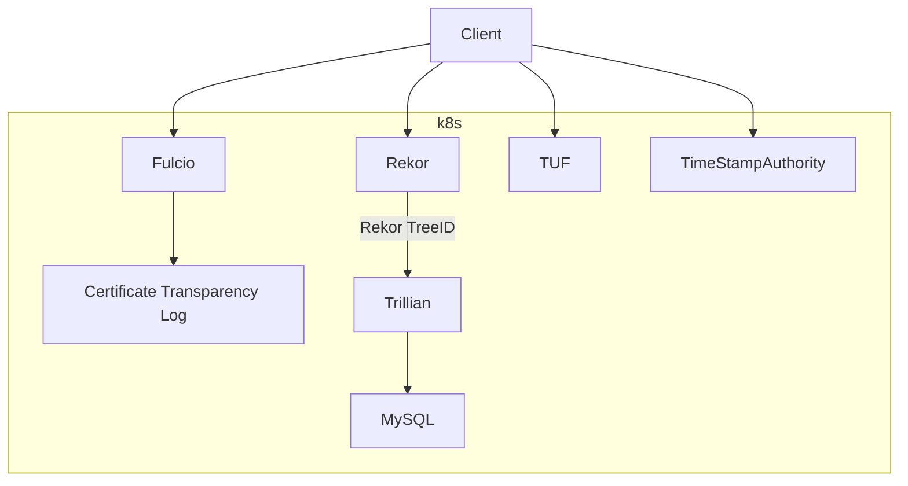

# scaffolding

This repository contains scaffolding to make standing up a full sigstore stack
easier and automatable. Our focus is on running on Kubernetes and rely on
several primitives provided by k8s as well as some semantics.

# Sigstore automation for tests or local development using KinD

<p style="text-align: right">
Ville Aikas &lt;vaikas@chainguard.dev></p>


<p style="text-align: right">
Nathan Smith &lt;sigstore@nfsmith.ca></p>


<p style="text-align: right">
2022-01-11</p>

# Quickstart

If you do not care about the nitty gritty details and just want to stand up a
local stack, check out the [Getting Started Guide](./getting-started.md)
If you want to just run sigstore in your GitHub actions, check out the
[actions](./actions/setup/README.md).

If you want to stand up a Sigstore stack on Google Cloud Platform using
Terraform, we provide
[GCP Terraform modules](https://github.com/sigstore/terraform-modules).

# Background

This repository is meant to make it easier to test projects that utilize
sigstore by making it easy to spin up a whole sigstore stack in a k8s cluster so
that you can do proper integration testing. With the provided `action` it's easy
also to add this capability to your GitHub Action testing.

If you are interested in figuring out the nitty/gritty manual way of standing
up a sigstore stack, a wonderful very detailed document for standing all the
pieces from scratch is given in Luke Hinds’
“[Sigstore the hard way](https://github.com/lukehinds/sigstore-the-hard-way)”

If you are interested in standing up a stack on your local machine, a great
documentation for all of them are provided by Thomas Strömberg
"[sigstore-the-local-way](https://github.com/tstromberg/sigstore-the-local-way)"

# Overview

This document is meant to describe what pieces have been built and why. The
goals are to be able to stand up a fully functional setup suitable for k8s
clusters, including KinD, which various projects use in our GitHub actions for
integration testing.

Because we assume k8s is the environment that we run in, we make use of a
couple of concepts provided by it that make automation easier.


* [Jobs](https://kubernetes.io/docs/concepts/workloads/controllers/job/) - Run
to completion abstraction. Creates pods, if they fail, will recreate until it
succeeds, or finally gives up.
* [ConfigMaps](https://kubernetes.io/docs/concepts/configuration/configmap/) -
Hold arbitrary configuration information
* [Secrets](https://kubernetes.io/docs/concepts/configuration/secret/) - Hold
secrety information, but care must be taken for these to actually be secret

By utilizing the Jobs “run to completion” properties, we can construct “gates”
in our automation, which allows us to not proceed until a Job completes
successfully (“full speed ahead”) or fails (fail the test setup and bail). These
take a form of using kubectl wait command, for example, waiting for jobs in
‘mynamespace’ to complete within 5 minutes or fail.:

```
kubectl wait --timeout 5m -n mynamespace --for=condition=Complete jobs --all
```

Another k8s concept we utilize is the ability to mount both ConfigMaps and
Secrets into Pods. Furthermore, if a ConfigMap or Secret (and more granularly a
‘key’ in either, but it’s not important) is not available, the Pod will block
starting. This naturally gives us another “gate” which allows us to deploy
components and rely on k8s to reconcile to a known good state (or fail if it can
not be accomplished).

# Components

Here’s a high level overview of the components in play that we would like to be
able to spin up with the lines depicting dependencies. Later on in the document
we will cover each of these components in detail, starting from the “bottom up”.



## [Rekor v2](https://github.com/sigstore/rekor-tiles)

Rekor needs a signing key, which can be created with:

```
pass=$(uuidgen)
openssl genpkey -algorithm ed25519 -out "/pki/key.pem" -pass pass:"${pass}"
openssl pkey -in "${rekordir}/key.pem" -out "/pki/pub.pem" -pubout
kubectl -n rekor-system create secret generic \
  --from-file=private=/pki/key.pem \
  --from-file=public=/pki/pub.pem \
  --from-literal=password=$pass \
  rekor-signing-secret
```

 * private - Holds the encrypted private key for signing
 * public - Holds the public key
 * password - Holds the password used to encrypt the key above.

Also create a secret for the public key that we'll need to be able to construct
a proper TUF root lateron. Create secret `rekor-pub-key` in namespace 
`rekor-system` holding entry `public` with the public key.

## Fulcio

For Fulcio we just need to create a Root Certificate that it will use to sign
incoming Signing Certificate requests. For this we will need to create a self
signed certificate, private key as well as password used to encrypt the
private key.  Basically we need to ensure we have all the
[necessary pieces](https://github.com/sigstore/fulcio/blob/156bc98ddacda11850d7aad5f37cda94ed160315/cmd/app/serve.go#L91-L93)
to start up Fulcio.

This ‘**createcerts**’ job just creates the pieces mentioned above and creates
two Secrets, one called `fulcio-secrets` containing the following keys:
These pieces can be created using openssl:

```
pass=$(uuidgen)
openssl ecparam -name prime256v1 -genkey | openssl pkcs8 -passout "pass:${pass}" -topk8 -out "/pki/key.pem"
openssl req -x509 -new -key "/pki/key.pem" -out "/pki/cert.pem" -sha256 -days 10 -subj "/O=yourorg/CN=fulcio.your.domain" -passin "pass:${pass}"
kubectl -n fulcio-system create secret generic --from-file=private=/pki/key.pem --from-file=cert=/pki/cert.pem --from-literal=password=${pass} fulcio-secret
```

We also create another secret that just holds the public information called
`fulcio-pub-key` that has one key:

* cert - Root Certificate

And as seen already above, we modify the Deployment to not start the Pod until
all the pieces are available, making our Deployment of Fulcio look (simplified
again) like this.


```
spec:
  template:
    spec:
      containers:
      - image: gcr.io/projectsigstore/fulcio@sha256:66870bd6b111f3c5478703a8fb31c062003f0127b2c2c5e49ccd82abc4ec7841
        name: fulcio
        args:
          - "serve"
          - "--port=5555"
          - "--ca=fileca"
          - "--fileca-key"
          - "/var/run/fulcio-secrets/key.pem"
          - "--fileca-cert"
          - "/var/run/fulcio-secrets/cert.pem"
          - "--fileca-key-passwd"
          - "$(PASSWORD)"
          - "--ct-log-url=http://ctlog.ctlog-system.svc"
        env:
        - name: PASSWORD
          valueFrom:
            secretKeyRef:
              name: fulcio-secret
              key: password
        volumeMounts:
        - name: fulcio-cert
          mountPath: "/var/run/fulcio-secrets"
          readOnly: true
      volumes:
      - name: fulcio-cert
        secret:
          secretName: fulcio-secret
          items:
          - key: private
            path: key.pem
          - key: cert
            path: cert.pem

```


## [CTLog](https://github.com/transparency-dev/tesseract)

> **_NOTE:_** CTLog used to be the ct_server binary from
> [certificate-tranpsarency-go](https://github.com/google/certificate-transparency-go).
> We now use [TesseraCT](https://github.com/transparency-dev/tesseract) which
> does not require Trillian or MySQL.

CTLog also needs its own public and private keys created, and it needs to know
Fulcio's root certificate. The private key for this server is not encrypted:

```
openssl ecparam -name prime256v1 -genkey -noout -out "/pki/ctkey.pem"
openssl ec -in "${ctdir}/key.pem" -pubout -out "/pki/ctpub.pem"
kubectl -n ctlog-system create secret generic --from-file=private=/pki/ctkey.pem \
    --from-file=public=/pki/pub.pem \
    --from-file=fulcio=/tmp/cert.pem \  # use the Fulcio CA generated above
    ctlog-secret
```

Also create a secret just for the public key:

* ctlog-public-key - Holds the public key for CTLog so that clients calling
Fulcio will able to verify the SCT that they receive from Fulcio.

Again by using the fact that the Pod will not start until all the required
ConfigMaps / Secrets are available, we can configure the CTLog deployment to
block until everything is available. Again for brevity some things have been
left out, but the CTLog configuration would look like so:

```
spec:
  template:
    spec:
      containers:
        - name: ctfe
          image: ghcr.io/transparency-dev/tesseract/posix:v0.1.1@sha256:8269c32a1b1deb159ba75016421314cb5e68304c2813d444aca3efdf0e9d5027
          args: [
            "--http_endpoint=0.0.0.0:6962",
            "--storage_dir=/ctfe",
            "--origin=ctlog.ctlog-system.svc",
            "--ext_key_usages=CodeSigning",
            "--v=1",
            "--private_key=/ctfe-keys/private",
            "--roots_pem_file=/ctfe-keys/fulcio",
          ]
          volumeMounts:
          - name: keys
            mountPath: "/ctfe-keys"
            readOnly: true
      volumes:
        - name: keys
          secret:
            secretName: ctlog-secret
```

Here instead of mounting into environmental variables, we must mount to the
filesystem given how the CTLog expects these things to be materialized.

Also, the reason why the public key was created in a different secret is because
clients will need access to this key because they need that public key to verify
the SCT returned by the Fulcio to ensure it actually was properly signed.

## [TimeStamp Authority](https://github.com/sigstore/timestamp-authority)

TimeStamp Authority (TSA) is a service for issuing
[RFC 3161](https://datatracker.ietf.org/doc/html/rfc3161) timestamps.

We first create a [createcertchain](./tools/tsa/cmd/tsa/createcertchain/main.go) job which
will create a Certificate Chain suitable for TSA. For example, the certificate
must have usage set to `Time Stamping`. The jobs creates a secret called
`tsa-cert-chain` in the `tsa-system` namespace, and as you may have guessed
the TSA Server mounts that secret and again won't start until the secret has
been created.

## TUF

Ok, so I lied. We also need to set up a tuf root so that cosign will trust all
the pieces we just stood up. The tricky bit here has to do with the fact that
sharing secrets across namespaces is not really meant to be done. We could
create a reconciler for this, but that would give access to all the secrets
in all the namespaces, which is not great, so we'll work around that by
having another step where we manually copy the secrets to `tuf-system` namespace
so that we can create a proper tuf root that `cosign` can use.

There are two steps in the process, first, copy ctlog, fulcio, rekor and TSA
public secrets into the `tuf-system` namespace, followed by a construction
of a tuf root from those pieces of information. In addition to that, we'll need
to have a tuf web server that serves the root information so that tools like
`cosign` can validate the roots of trust.

For that, we need to copy the following secrets (namespace/secret) with the
keys in the secrets into the `tuf-system` namespace so that the job there has
enough information to construct the tuf root:

* fulcio-system/fulcio-pub-key
  - cert - Holds the Certificate for Fulcio
  - public - Holds the public key for Fulcio
* ctlog-system/ctlog-pub-key
  - public - Holds the public key for CTLog
* rekor-system/rekor-pub-key
  - public - Holds the public key for Rekor
* tsa-system/tsa-cert-chain
  - cert-chain - Holds the certificate chain for TimeStamp Authority

Certificate chains for fulcio and TSA can either be provided in a single file
or in individual files. When providing as individual files, the following
file naming scheme has to be followed:

* `<target>_root.crt.pem`, e.g. `tsa_root.crt.pem`
* `<target>_intermediate_0.crt.pem`, e.g. `tsa_intermediate_0.crt.pem`
* `<target>_intermediate_1.crt.pem`, e.g. `tsa_intermediate_1.crt.pem`
* (more intermediates, but at most 10 intermediate certificates altogether)
* `<target>_leaf.crt.pem`, e.g. `tsa_leaf.crt.pem`

Intermediate certificates, if provided, must be ordered correctly:
`intermediate_0` is signed by `root`, `intermediate_1` is signed by
`intermediate_0` etc.

Once we have all that information in one place, we can construct a tuf root out
of it that can be used by tools like `cosign` and `policy-controller`.

# Other rando stuff

This document focused on the Tree management, Certificate, Key and such creation
automagically, coordinating the interactions and focusing on the fact that no
manual intervention is required at any point during the deployment and relying
on k8s primitives and semantics. If you need any customization of where things
live, or control any knobs, you might want to look at the
[helm charts](https://github.com/sigstore/helm-charts/tree/main/charts/scaffold)
that wrap this repo in a more customizable way.
